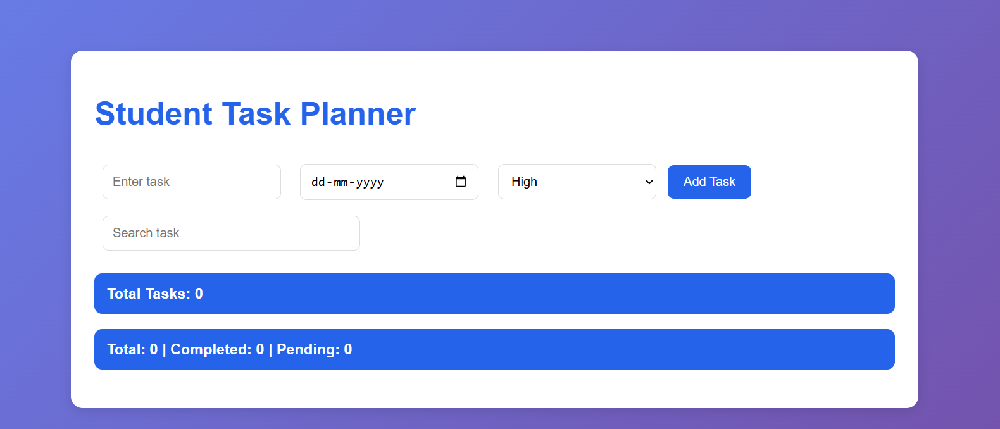
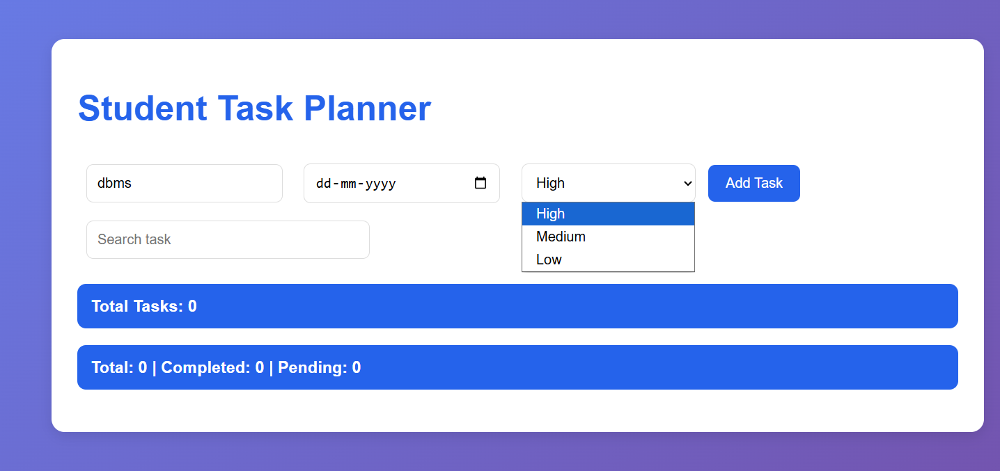
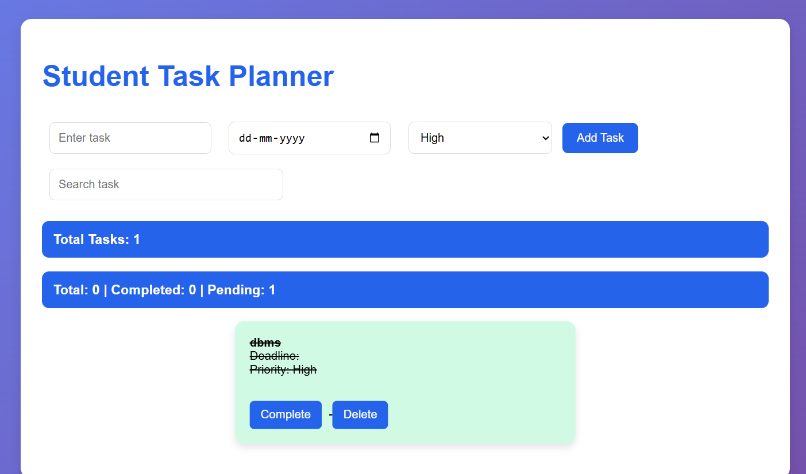

# Student Task Planner

A responsive Student Task Planner web application built using HTML, CSS, and JavaScript.

## Features

- Add tasks
- Delete tasks
- Mark tasks as completed
- Priority management
- Deadline tracking
- Task counter
- Local storage support

## Technologies Used

- HTML
- CSS
- JavaScript
- Local Storage

## Screenshots

### Dashboard

### Add Task

### Completed Task

## Author

Ashish Mishra
